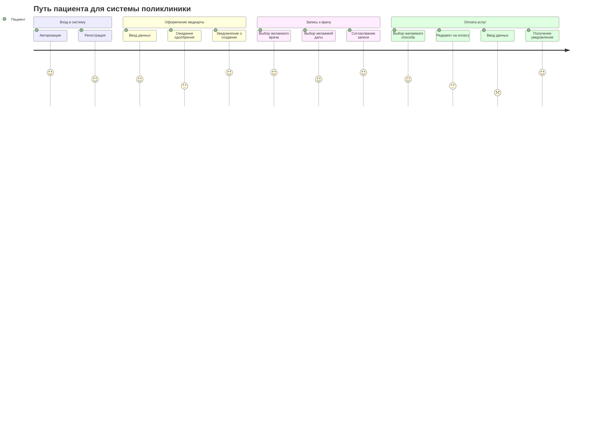

# Клиент-Серверная Система
Этот проект представляет клиент-серверную систему, включая взаимодействие между клиентом, API и сервером.

```mermaid
    journey
    title Путь пациента для системы поликлиники
    section Вход в систему
      Авторизация: 5: Пациент
      Регистрация: 4: Пациент
    section Оформление медкарты
      Ввод данных: 4: Пациент
      Ожидание одообрения: 3: Пациент
      Уведомление о создании: 5: Пациент
    section Запись к врачу
      Выбор желаемого врача: 5: Пациент
      Выбор желаемой даты: 4: Пациент
      Согласование записи: 5: Пациент
    section Оплата услуг
      Выбор желаемого способа: 4: Пациент
      Редирект на оплату: 3: Пациент
      Ввод данных: 2: Пациент
      Получение уведомления: 5: Пациент
```